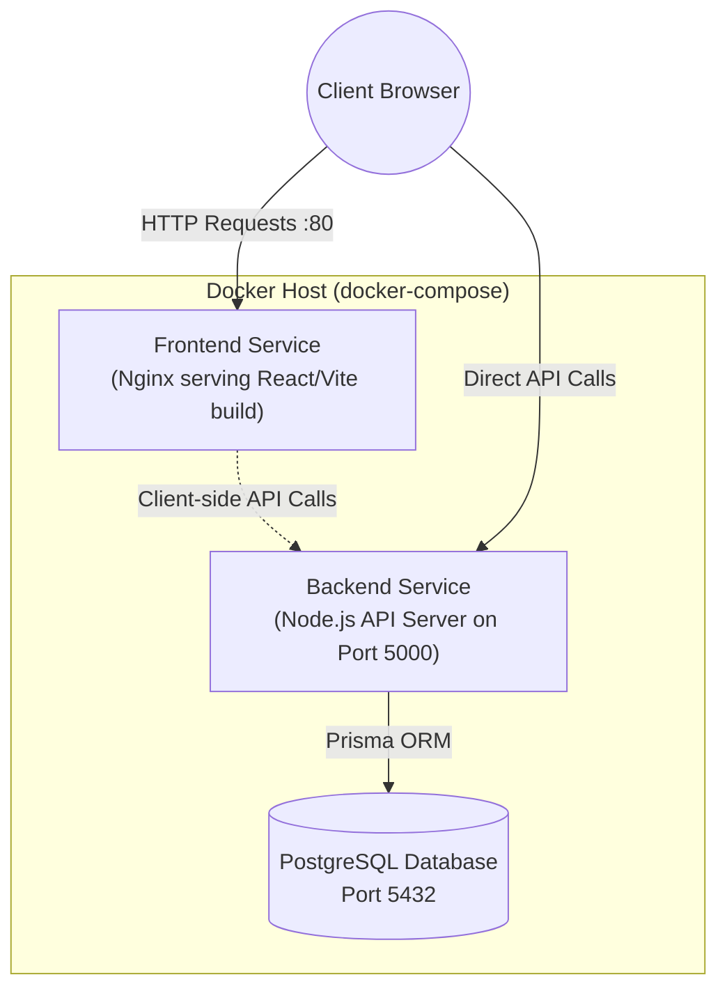

# Task-Flow

Task-Flow is a personal task management web application built to cleanly and effectively track your daily to-dos. It offers a full-stack architecture with a dynamic React frontend and a robust Node.js backend using Prisma and PostgreSQL.

## Features

- **View All Tasks**: See a list of tasks with their title, description, priority, status, and creation date.
- **Add & Edit Tasks**: Easily create new tasks or update existing ones, including changing their status.
- **Delete Tasks**: Remove tasks permanently with a single click.
- **Filter**: Filter tasks by status and priority.
- **Dockerized Environment**: The entire stack is containerized for seamless setup and execution.

## Tech Stack

### Frontend
- **React 19**
- **Vite**
- **Framer Motion** (for smooth UI animations)
- **Axios** (for API requests)

### Backend
- **Node.js & Express**
- **Prisma ORM**
- **PostgreSQL**
- **Zod** (for request validation)

### Infrastructure
- **Docker & Docker Compose**
- **Nginx** (serving the frontend production build)

## Architecture Diagram

The application uses a containerized multi-service architecture:



## Prerequisites

To run this application locally, you will need to have installed:
- [Docker](https://docs.docker.com/get-docker/)
- [Docker Compose](https://docs.docker.com/compose/install/)

*(Note: Node.js and PostgreSQL are NOT required locally if you use the Docker setup, as they are fully contained inside Docker).*

## Local Setup & Running the Application

### 1. Environment Configuration

The repository comes with a `.env.example` in the backend directory. When using Docker, the `docker-compose.yml` automatically provides the necessary environment variables, so manual setup isn't strictly necessary for local Docker execution.

### 2. Run with Docker Compose

Open your terminal in the root directory of the project and execute:

```bash
docker-compose up --build
```

This command will:
1. Pull the necessary images (`postgres`, `node`, `nginx`).
2. Build the `backend` image, run `prisma generate`, and start the Node server. Before the server starts, it will automatically synchronize the database schema using `npx prisma db push`.
3. Build the `frontend` Vite app into a production bundle and serve it using Nginx.

### 3. Access the Application

Once the containers are up and running, you can access the different components:
- **Frontend web app**: [http://localhost](http://localhost)
- **Backend API endpoint**: [http://localhost:5000/api/tasks](http://localhost:5000/api/tasks)

### 4. Stopping the Application

To shut down the application and database, run:

```bash
docker-compose down
```
*(Note: Data is persisted in a named Docker volume `pgdata`, so you will not lose your tasks between restarts.)*

## Additional Scripts

If you want to run the project without Docker, navigate to the respective folders and use npm:

**Backend:**
```bash
cd backend
npm install
# Set your DATABASE_URL in an .env file
npx prisma db push
npm run dev
```

**Frontend:**
```bash
cd frontend
npm install
npm run dev
```

## Deployment

The frontend of this application has also been deployed using **Vercel**. 

- **Live URL**: [Add your Vercel deployment link here]
- **Vercel Configuration**: Vercel automatically detects the Vite framework and builds the app using `npm run build` and serves the `dist` directory.

*(Make sure to update the live URL placeholder above with your actual Vercel project link).*

